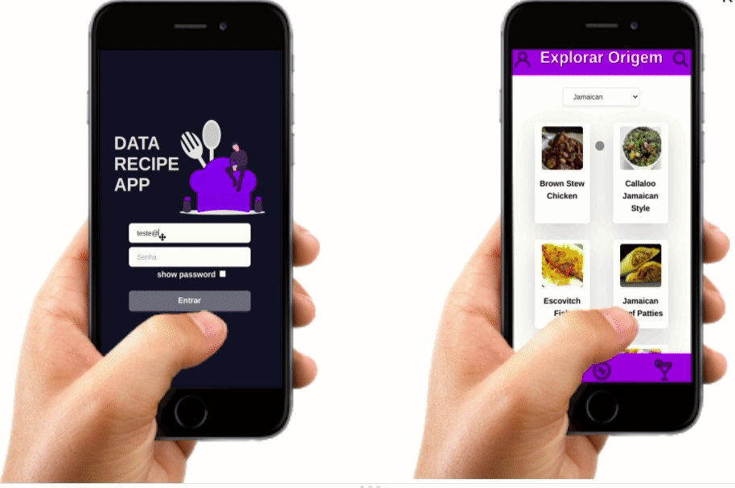

# Projeto App de Receitas

Projeto em grupo proposto pela [Trybe](https://www.betrybe.com/) com o objetivo de consolidar todos os conhecimentos de hard skills e soft skills desenvolvidos ao longo do módulo de front-end.

# Deploy do projeto
- [Acessar site](https://main.d1c34ifddgonvj.amplifyapp.com/)

## Desenvolvedores
- [Arthur Simões](https://github.com/ArthurSimoess)
- [Apolo Wilker](https://github.com/APOLOWILKER)
-  [Diego Ramos](https://github.com/Drb-Diego)
- [Thiago Monteiro](https://github.com/thiagoacmonteiro)

## Para acessar o código do Projeto:
1.Clone o repositório

-   `git clone git@github.com:ArthurSimoess/recipe-app.git`
-   Entre na pasta do repositório que você acabou de clonar:

2.Instale as dependências e inicialize o projeto

-   `npm install`
-   `npm start`

## Objetivo

O projeto foi feito com o propósito de desenvolver um app de receitas,  utilizando o que há de mais moderno dentro do ecossistema React: Hooks e Context API. 
Na aplicação é possível ver, buscar, filtrar, favoritar e acompanhar o processo de preparação de receitas e drinks.
O projeto tem como base de dados duas apis: [Mealdb](https://www.themealdb.com/api.php) e [Cocktaildb](https://www.thecocktaildb.com/api.php). 
O  layout tem como foco dispositivos móveis, trabalhando o conceito de mobile first.

## Habilidades Desenvolvidas

-  Utilização do Context API do React para gerenciar o estado;
-  Utilização das hooks: useState, useContext, useHistory e useEffect;
-  Cooperação e planejamento em grupo;
-  Metodologias ágeis.

## Aplicação

   

